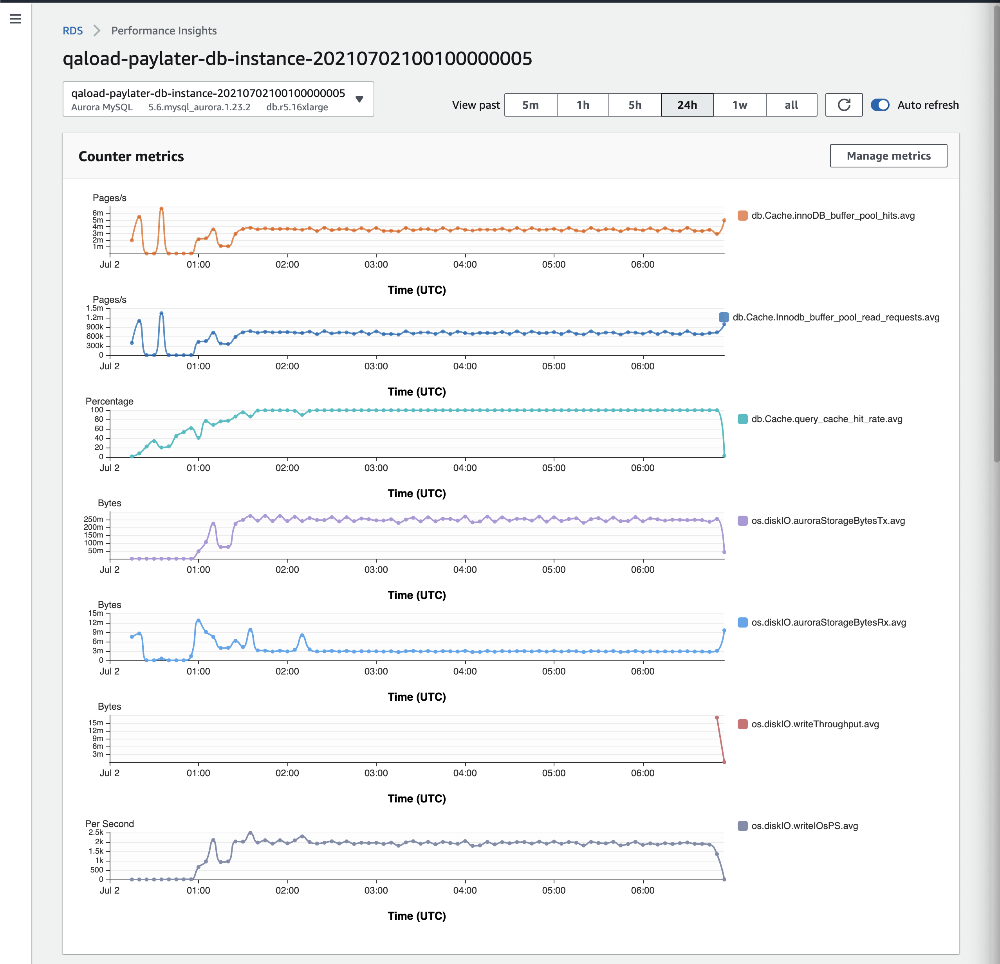

## 16 Jun 

--------------

A new metric found `auroraStorageBytesTx` which is very good indicator of the mysterious workload.

- good range: below 100m
- bad range: more than 200m
- 
- The number of bytes uploaded for aurora storage per second

- `auroraStorageBytesTx`
  - The number of bytes uploaded for aurora storage per second
- `auroraStorageBytesRx`
  - The number of bytes received for aurora storage per second

- Where does it upload to? 
  - it uploads to `Aurora Distributed Storage` spread across 3 AZs/region with 2 copies of your data per AZ. So this is the traffic moving from/to the Aurora Storage to and from the database instance. Please note that EBS attached to Aurora is not used to store your data, may be some caching and logging.
- Should they match? 
  - in my opinion, no (to be verified). Data from the Aurora Storage to the instance should be reads and vice versa. Terms TX and RX are a bit deceiving as it is not clear (to me) if we’re looking from the point of view of the storage or the instance.

## 17 Jun 

--------------


## Aurora Docs
- How Aurora storage automatically resizes
  - To display the volume status, see [Displaying volume status for an Aurora MySQL DB cluster](https://docs.aws.amazon.com/AmazonRDS/latest/AuroraUserGuide/AuroraMySQL.Managing.VolumeStatus.html) or Displaying volume status for an Aurora PostgreSQL DB cluster. For ways to balance storage costs against other priorities, Storage scaling describes how to monitor the Amazon Aurora metrics `AuroraVolumeBytesLeftTotal` and `VolumeBytesUsed` in CloudWatch.

- Amazon Aurora reliability
  - Survivable cache warming
    - Aurora "warms" the buffer pool cache when a database starts up after it has been shut down or restarted after a failure. That is, Aurora preloads the buffer pool with the pages for known common queries that are stored in an in-memory page cache. This provides a performance gain by bypassing the need for the buffer pool to "warm up" from normal database use.
    - The Aurora page cache is managed in a separate process from the database, which allows the page cache to survive independently of the database. In the unlikely event of a database failure, the page cache remains in memory, which ensures that the buffer pool is warmed with the most current state when the database restarts.

- From Islam
  - OK. So, the instance Bandwidth is shared across lots of things. Aurora Storage, EBS (local), binlog …
  - It looks like the Writer instance is saturating. However this requires some calculations. I would like to ask you to create a support case and share the: instance id and your findings. In the meantime, I will try to do the calculations myself. I am just conscious that I don’t have access to everything I need in terms of metrics, support will. Can you create the case?

- Some findings
  - The performance degradation starts from around 11 am 06-18, ends at 15:30
  - Performance insight
    - [Link](https://ap-southeast-2.console.aws.amazon.com/rds/home?region=ap-southeast-2#performance-insights-v20206:/resourceId/db-GFCSJIZGYVBCKENFYCYKHQSSSA/resourceName/qaload-paylater-db-instance-20210611090155576400000001/startTime/1623977836193/endTime/1623995836193)
  - Fri 18 work load took 5 hours
    - 
  - When zoom in, the datatbase load shows a saturation
    - 
  - CloudWatch dashboard
    - [Link](https://ap-southeast-2.console.aws.amazon.com/cloudwatch/home?region=ap-southeast-2#dashboards:name=qaload-db-perf-investigation;start=PT5H)
    - The BinLog size and Aurora Volume GBs left Total shows a interesting trend
      - 

- Further reads
  - https://docs.aws.amazon.com/AmazonRDS/latest/AuroraUserGuide/AuroraMySQL.Replication.CrossRegion.html


## case

- 


- 

### Some debug outputs when the secret workload is running

- Wait events group by source
  ```
  mysql> SELECT count(*), SOURCE        FROM performance_schema.events_waits_current group by SOURCE;
  +----------+-----------------------+
  | count(*) | SOURCE                |
  +----------+-----------------------+
  |        1 | binlog.cc:6439        |
  |        1 | dict0dict.cc:221      |
  |        1 | file_as_table.cc:3659 |
  |        1 | grover_repl.cc:2556   |
  |        1 | ibuf0ibuf.cc:2846     |
  |        1 | lock0newlock.cc:6180  |
  |        1 | lock0newwait.cc:792   |
  |        1 | log0log.ic:419        |
  |        1 | mysqld.cc:4577        |
  |        1 | mysqld.cc:9830        |
  |        2 | my_thr_init.c:359     |
  |       39 | os0sync.cc:899        |
  |     1121 | sql_class.cc:5689     |
  |        1 | sql_class.h:2234      |
  |        1 | sql_plugin.cc:796     |
  |        1 | srv0srv.cc:2852       |
  |        1 | trx0trx.cc:741        |
  +----------+-----------------------+
  17 rows in set (0.00 sec)
  ```

- Wait events group by event name
  ```
  mysql> SELECT count(*), EVENT_NAME     FROM performance_schema.events_waits_current group by EVENT_NAME;
  +----------+-------------------------------------------------+
  | count(*) | EVENT_NAME                                      |
  +----------+-------------------------------------------------+
  |        1 | wait/synch/cond/sql/COND_server_started         |
  |        1 | wait/synch/cond/sql/FILE_AS_TABLE::cond_request |
  |        1 | wait/synch/cond/sql/MYSQL_BIN_LOG::update_cond  |
  |        1 | wait/synch/mutex/innodb/fil_system_mutex        |
  |        1 | wait/synch/mutex/innodb/ibuf_mutex              |
  |        1 | wait/synch/mutex/innodb/lock_wait_mutex         |
  |       39 | wait/synch/mutex/innodb/os_mutex                |
  |        2 | wait/synch/mutex/innodb/trx_sys_mutex           |
  |        2 | wait/synch/mutex/mysys/THR_LOCK_threads         |
  |        1 | wait/synch/mutex/sql/LOCK_plugin                |
  |        1 | wait/synch/mutex/sql/LOCK_thread_count          |
  |        1 | wait/synch/mutex/sql/SERVER_THREAD::LOCK_sync   |
  |     1102 | wait/synch/mutex/sql/THD::LOCK_thd_data         |
  |        1 | wait/synch/rwlock/innodb/dict sys RW lock       |
  |        1 | wait/synch/rwlock/innodb/trx_purge_latch        |
  +----------+-------------------------------------------------+
  15 rows in set (0.01 sec)
  ```

- Most time consuming sql

  ```
  mysql> SELECT count(*), SQL_TEXT, sum(TIMER_WAIT) as sum FROM performance_schema.events_statements_current group by SQL_TEXT desc order by sum desc;
  +----------+----------------------------------------------------------------------------------------------------------------------------------------------+-------------------+
  | count(*) | SQL_TEXT                                                                                                                                     | sum               |
  +----------+----------------------------------------------------------------------------------------------------------------------------------------------+-------------------+
  |      694 | NULL                                                                                                                                         | 16834844969948000 |
  |      234 | select case when @@read_only + @@innodb_read_only = 0 then 1 else (select table_name from information_schema.tables) end as `1`              |       27505328000 |
  |        1 | SELECT count(*), SQL_TEXT, sum(TIMER_WAIT) as sum FROM performance_schema.events_statements_current group by SQL_TEXT desc order by sum desc |        9779103000 |
  |       28 | SET sql_mode='STRICT_TRANS_TABLES'                                                                                                           |        5755960000 |
  |        2 | SET autocommit=1                                                                                                                             |         721500000 |
  |        1 | SET @@sql_log_bin=on                                                                                                                         |         536095000 |
  |        9 | SELECT @@session.tx_read_only                                                                                                                |         375658000 |
  |        1 | PURGE BINARY LOGS BEFORE '2021-05-08 03:55:25'                                                                                               |         312794000 |
  |        1 | set local oscar_local_only_replica_host_status=0                                                                                             |         131821000 |
  |        1 | SELECT @@aurora_version                                                                                                                      |          93256000 |
  |        1 | SHOW MASTER STATUS                                                                                                                           |          27713000 |
  +----------+----------------------------------------------------------------------------------------------------------------------------------------------+-------------------+
  11 rows in set (0.02 sec)
  ```


- Processes grouped by state
  - many of them in the init state

  ```
  mysql> select count(*), sum(TIME),  STATE from INFORMATION_SCHEMA.PROCESSLIST where COMMAND <> "Sleep" group by STATE ;
  +----------+-----------+--------------------------------+
  | count(*) | sum(TIME) | STATE                          |
  +----------+-----------+--------------------------------+
  |        1 |         0 | checking query cache for query |
  |        1 |         0 | Creating sort index            |
  |        1 |         0 | Creating tmp table             |
  |        1 |         0 | delayed commit ok initiated    |
  |        1 |         0 | executing                      |
  |      111 |       464 | init                           |
  |        1 |      5985 | Sending binlog event to slave  |
  |        2 |         0 | Sending data                   |
  +----------+-----------+--------------------------------+
  8 rows in set (0.01 sec)
  ```


- getting ft cache size

  ```
  mysql> show global variables like 'innodb_ft_cache_size';
  +----------------------+---------+
  | Variable_name        | Value   |
  +----------------------+---------+
  | innodb_ft_cache_size | 8000000 |
  +----------------------+---------+
  1 row in set (0.00 sec)

  mysql> show global variables like 'innodb_ft_total_cache_size';
  +----------------------------+-----------+
  | Variable_name              | Value     |
  +----------------------------+-----------+
  | innodb_ft_total_cache_size | 640000000 |
  +----------------------------+-----------+
  1 row in set (0.01 sec)
  ```


r5.16xlarge
- 
- 
- 