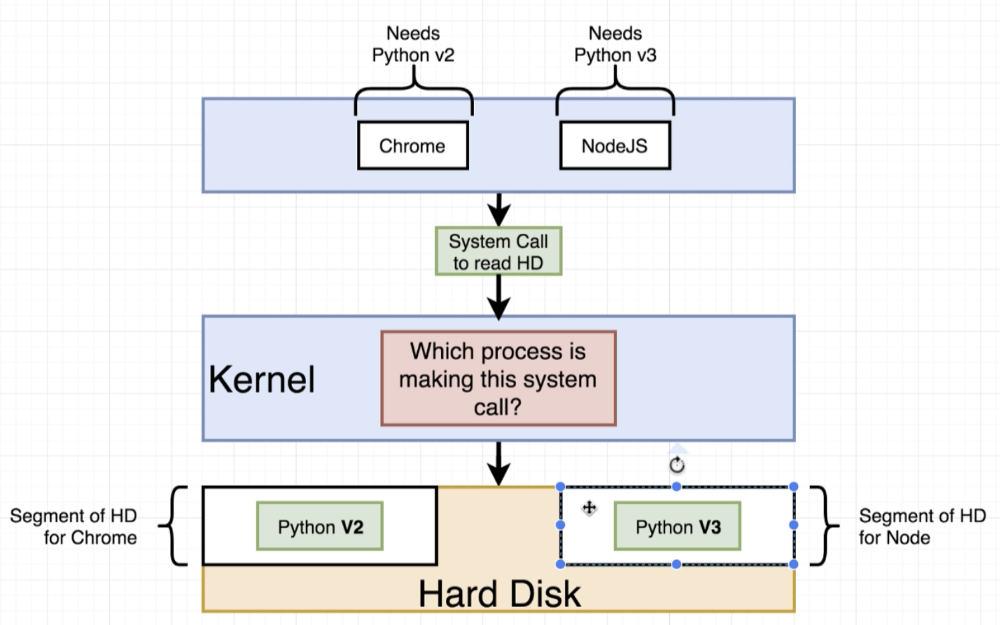
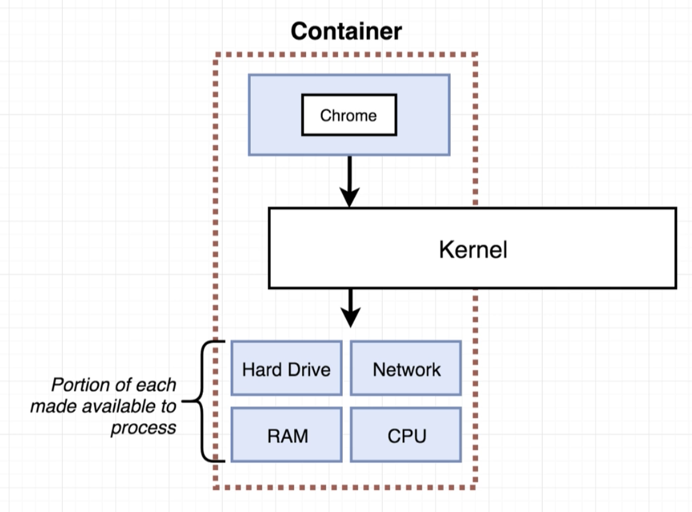

# Section 1: Dive Into Docker!

Section 1: Dive Into Docker!
1 / 13|35min

1. Finished Code Repositories and Diagrams
1min

2. Why Use Docker?
4min

3. What is Docker?
3min

4. Docker for Mac/Windows
2min
- Docker for Mac/Windows
  - 

5. Installing Docker on MacOS
5min

6. Installing Docker for Windows Home users
1min

7. Installing Docker for Windows Profressional
2min

8. More Windows Professional Setup
1min

9. One Last Piece of Windows Professional Setup
1min

10. Installing Docker on Linux
1min

11. Using the Docker Client
5min

    - What happens after docker run hello-world
      - 

12.  But Really...What's a Container?
9min
     - Your OS
       - 
     - The problem
       - 
     - solutions:
       - namespacing
         - 
        - namespacing and control group
          - 
      - Container
        - 
      - Relation between a image and container
        - 

13.  How's Docker Running on Your Computer?
3min
- namespacing and control group are part of linux. Doesn't come with macos or windows. 
  - 
  - docker version
    - 

